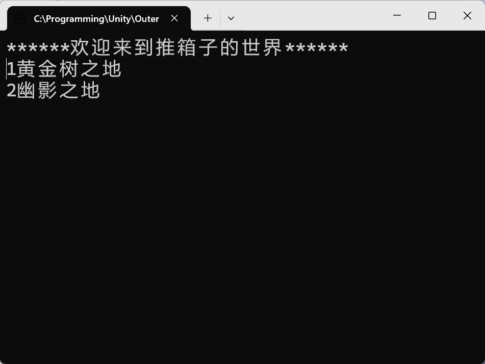
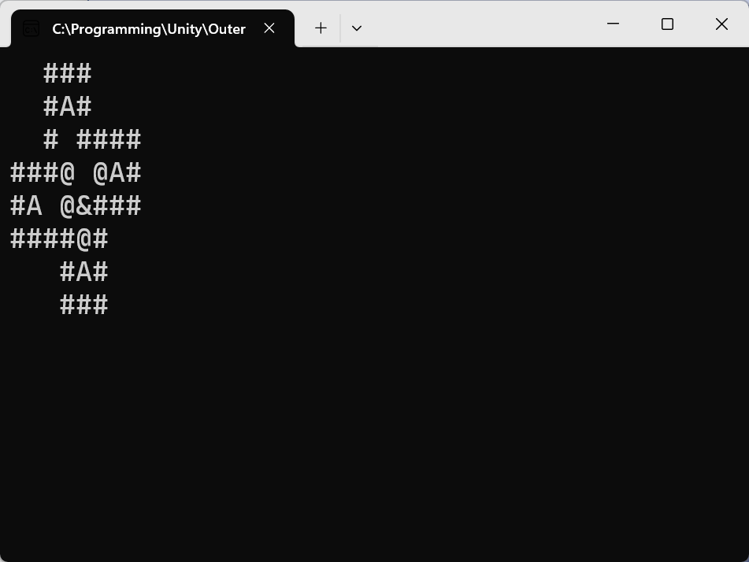
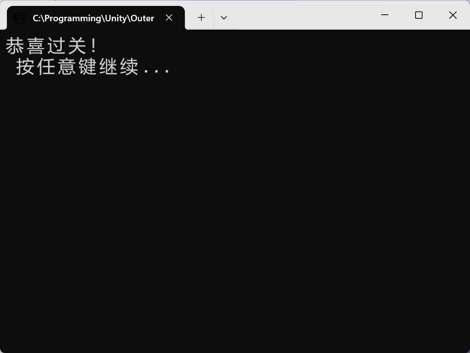

# PushingtheBox
 
🌐 [English README](./README.en.md)

使用C#和Console制作的推箱子游戏。

涉及控制台渲染和游戏开发逻辑。

## 技术栈 🛠️ 
开发语言：C#、Console

主框架：MVC

输入：System.Console

配置文件：JSON

有使用的插件：Newtonsoft.Json

## 项目展示 💞




## 控制 👾
 🅆 🄰 🅂 🄳  移动 

 ⇧/⇩ + ⏎   菜单选择 / 确认 

## 项目系统 🧩
| 系统 | 说明 |
|:--|:--|
| 地图表示 | 地图元素：墙、玩家、箱子、目标 |
| 玩家输入与移动 | \ |
| 箱子推动判定 | 判断箱子能否被推动（比如说前方是墙则无法推动） |
| 地图碰撞体判定 | \ |
| 单局判定 | 关卡选择、关卡胜利判定 |
| 配置文件| stageInfos.json |

## stageInfos.json ✨
关卡配置文件的代码示意

```json
[
  {
    "Name": "黄金树之地",
    "width": 8,
    "height": 8,
    "playerX": 4,
    "playerY": 4,
    "boxCount": 4,
    "elements": [
      [ 0, 0, 1, 1, 1, 0, 0, 0 ],
      [ 0, 0, 1, 3, 1, 0, 0, 0 ],
      [ 0, 0, 1, 0, 1, 1, 1, 1 ],
      [ 1, 1, 1, 2, 0, 2, 3, 1 ],
      [ 1, 3, 0, 2, 0, 1, 1, 1 ],
      [ 1, 1, 1, 1, 2, 1, 0, 0 ],
      [ 0, 0, 0, 1, 3, 1, 0, 0 ],
      [ 0, 0, 0, 1, 1, 1, 0, 0 ]
    ]
  },
  {
    "Name": "幽影之地",
    "width": 9,
    "height": 9,
    "playerX": 1,
    "playerY": 1,
    "boxCount": 3,
    "elements": [
      [ 1, 1, 1, 1, 1, 0, 0, 0, 0 ],
      [ 1, 0, 0, 0, 1, 0, 0, 0, 0 ],
      [ 1, 0, 2, 2, 1, 0, 1, 1, 1 ],
      [ 1, 0, 2, 0, 1, 0, 1, 3, 1 ],
      [ 1, 1, 1, 0, 1, 1, 1, 3, 1 ],
      [ 0, 1, 1, 0, 0, 0, 0, 3, 1 ],
      [ 0, 1, 0, 0, 0, 1, 0, 0, 1 ],
      [ 0, 1, 0, 0, 0, 1, 1, 1, 1 ],
      [ 0, 1, 1, 1, 1, 1, 0, 0, 0 ]
    ]
  }
]
```
